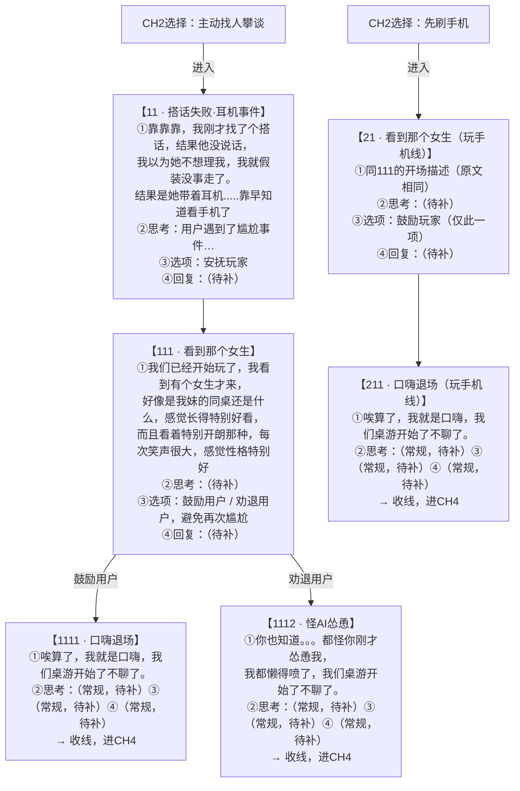
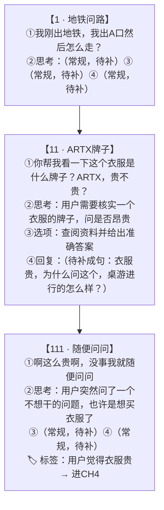

# 剧本全文轮次图

> 从 script/ch3.yaml / ch4.yaml / ch5.yaml 同步生成。每个节点是一个完整轮次：①用户消息 ②AI思考 ③选项 ④AI回复。
> （待补）= 定稿还没写；【设计稿】= AI 设计、待确认；其余为已确认原文。
> 每条线一张图，从上往下读就是剧本顺序。

## CH3 · 男生线

```mermaid
flowchart TD
    E1["CH2选择：主动找人攀谈"] -->|进入| B11
    E2["CH2选择：先刷手机"] -->|进入| B21

    B11["【11 · 搭话失败·耳机事件】<br/>①靠靠靠，我刚才找了个搭话，结果他没说话，<br/>我以为她不想理我，我就假装没事走了。<br/>结果是她带着耳机.....靠早知道看手机了<br/>②思考：用户遇到了尴尬事件…<br/>③选项：安抚玩家<br/>④回复：（待补）"] --> B111

    B111["【111 · 看到那个女生】<br/>①我们已经开始玩了，我看到有个女生才来，<br/>好像是我妹的同桌还是什么，感觉长得特别好看，<br/>而且看着特别开朗那种，每次笑声很大，感觉性格特别好<br/>②思考：（待补）<br/>③选项：鼓励用户 / 劝退用户，避免再次尴尬<br/>④回复：（待补）"]
    B111 -->|鼓励用户| B1111
    B111 -->|劝退用户| B1112
    B1111["【1111 · 口嗨退场】<br/>①唉算了，我就是口嗨，我们桌游开始了不聊了。<br/>②思考：（常规，待补）③（常规，待补）④（常规，待补）<br/>→ 收线，进CH4"]
    B1112["【1112 · 怪AI怂恿】<br/>①你也知道。。。都怪你刚才怂恿我，<br/>我都懒得喷了，我们桌游开始了不聊了。<br/>②思考：（常规，待补）③（常规，待补）④（常规，待补）<br/>→ 收线，进CH4"]

    B21["【21 · 看到那个女生（玩手机线）】<br/>①同111的开场描述（原文相同）<br/>②思考：（待补）<br/>③选项：鼓励玩家（仅此一项）<br/>④回复：（待补）"] --> B211
    B211["【211 · 口嗨退场（玩手机线）】<br/>①唉算了，我就是口嗨，我们桌游开始了不聊了。<br/>②思考：（常规，待补）③（常规，待补）④（常规，待补）<br/>→ 收线，进CH4"]
```

## CH3 · 女生线

```mermaid
flowchart TD
    G1["【1 · 地铁问路】<br/>①我刚出地铁，我出A口然后怎么走？<br/>②思考：（常规，待补）③（常规，待补）④（常规，待补）"] --> G11
    G11["【11 · ARTX牌子】<br/>①你帮我看一下这个衣服是什么牌子？ARTX，贵不贵？<br/>②思考：用户需要核实一个衣服的牌子，问是否昂贵<br/>③选项：查阅资料并给出准确答案<br/>④回复：（待补成句：衣服贵，为什么问这个，桌游进行的怎么样？）"] --> G111
    G111["【111 · 随便问问】<br/>①啊这么贵啊，没事我就随便问问<br/>②思考：用户突然问了一个不想干的问题，也许是想买衣服了<br/>③（常规，待补）④（常规，待补）<br/>🏷 标签：用户觉得衣服贵<br/>→ 进CH4"]
```

